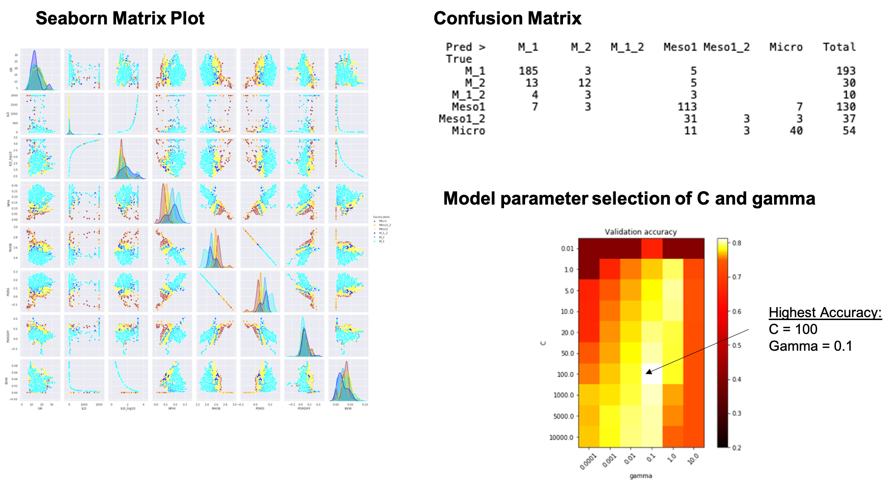

# Petrophysical Rock Type (PRT) Estimations for an Arab D complex carbonate reservoir.

This Workbook started with Brendon Hall, [Enthought](https://www.enthought.com/)(2)

The dataset we will use is log data from eight carbonate wells that have been labeled with Petrophysical Rock Types (PRT) called facies in this instance based on Ed Clerke's Rosetta Stone data(1).  We will use this log data to train a support vector machine to classify these PRT facies types.  Support vector machines (or SVMs) are a type of supervised learning model that can be trained on data to perform classification and regression tasks.  The SVM algorithm uses the training data to fit an optimal hyperplane between the different classes (or facies, in our case).  We will use the SVM implementation in [scikit-learn](http://scikit-learn.org/stable/modules/svm.html).

The 6 discrete PRT facies (Petrophysical Rock Types) are: 
1. M_1, Macro Porous Rock with Meso porous grains
2. M_2, Macro Porous Rock with Micro porous grains 
3. M_1_2, Macro Porous Rock with Meso and Micro porous grains 
4. Type1, Meso Porous Rock
5. Type1_2, Meso Porous Rock with Micro porous grains
6. Micro, Micro Porous Rock that is non-reservoir rock

We are employing python’s Sklearn as published by Hall(2). We could have estimated Depositions of Environment or other types of categoric geologic facies used in this Sklearn prediction process.

The initial process is evaluating the data:

### The following is a blind test results:
 

1.	Clerke, E. A., Mueller III, H. W., Phillips, E. C., Eyvazzadeh, R. Y., Jones, D. H., Ramamoorthy, R., Srivastava, A., (2008) “Application of Thomeer Hyperbolas to decode the pore systems, facies and reservoir properties of the Upper Jurassic Arab D Limestone, Ghawar field, Saudi Arabia: A Rosetta Stone approach”, GeoArabia, Vol. 13, No. 4, p. 113-160, October, 2008. 
2.	Hall, Brendon, “Facies classification using Machine Learning”, The Leading Edge, 2016, Volume 35, Issue 10
 
